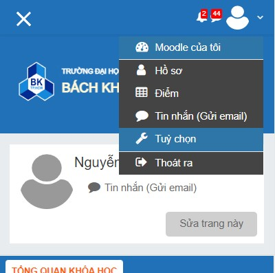
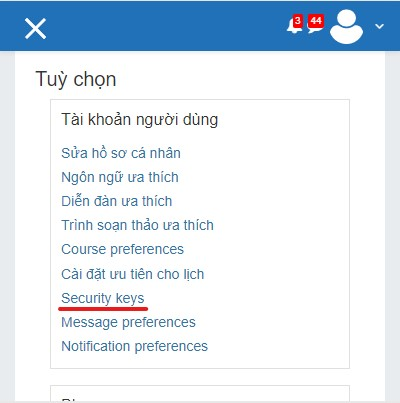
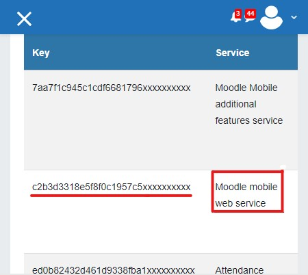

# E-learnping! Server

## Instruction

1. Install Redis for cache database
2. Make a `.env` file with Redis connection details (see `.env.example`)
3. Run Redis server

```bash
$ redis-server
```

4. Run server

```bash
$ go run .
```

5. Make GET requests to server, with your moodle token as Bearer token on Authorization header.

```bash
$ curl \
    --location --request GET 'localhost:8080/api/sites' \
    --header 'Authorization: Bearer {{YOUR_MOODLE_TOKEN_HERE}}' \
    | python3 -m json.tool
```

## Where to find your Moodle token?

Login into e-learning site. Inside the menu on the arrow left of your avatar,
click "Tùy chọn"



Click "Security keys".



Your token is the "Moodle mobile web service" one.


